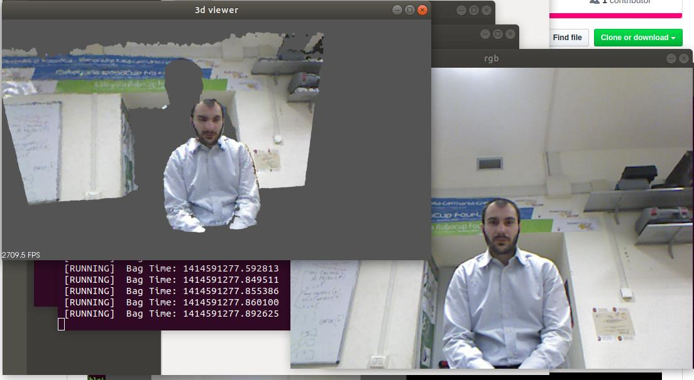

# basic_3d_visualizer
A simple 3D visualizer for RGBD data

basic_3d_visualizer uses
- ROS (tested with melodic)
- OpenCV (tested with version 4.2)
- PCL

Try it by downloading [this ROS bag](http://www.dis.uniroma1.it/~bloisi/didattica/RobotProgramming/face.bag)

This code is part of the material of the course [Computer Vision and Machine Perception](http://web.unibas.it/bloisi/corsi/visione-e-percezione.html) - University of Basilicata (Italy)

**basic_3d_visualizer is distributed in the hope that it will be useful,
but WITHOUT ANY WARRANTY; without even the implied warranty of
MERCHANTABILITY or FITNESS FOR A PARTICULAR PURPOSE.**
 
Please, report suggestions/comments/bugs to 
domenico.bloisi@gmail.com

